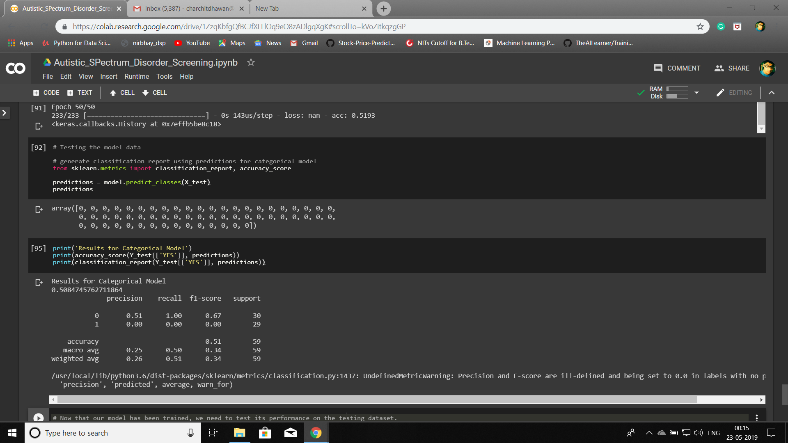

# Childhood-Austism-Disorder-Screening

#### Childhood Autistic Spectrum Disorder Screening using Machine Learning : The early diagnosis of neurodevelopment disorders can improve treatment and significantly decrease the associated healthcare costs. In this project, we will use supervised learning to diagnose Autistic Spectrum Disorder (ASD) based on behavioural features and individual characteristics. More specifically, we will build and deploy a neural network using the Keras API.

* Importing the Dataset(https://archive.ics.uci.edu/ml/datasets/Autistic+Spectrum+Disorder+Screening+Data+for+Children++)
* Processing of Data 
* Split the Dataset into Training and Testing Datasets
* Build network with Keras
* Train the Network
* Testing of Data on Performance Metrics

### Resulting in low Variance, maintaining the consistancy of Train and Test splitting data.

